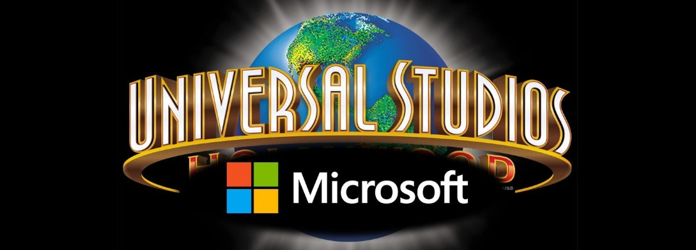

# Microsoft Film Venture

**Author**: [Rafael V Rabinovich](mailto:rafvrab@gmail.com)

# Business Understanding

I will use my data analysis expertise and knowledge of the business environment to provide a comprehensive assessment of the film industry, helping Microsoft make an informed decision on whether and how to enter this field.


# Business Problem

<div style="float: left; margin-right: 10px;">
    
</div>
<p>The problem I need to resolve is to use data analysis to identify the key factors driving success in the film industry and use this information to make data-driven recommendations for Microsoft's potential investment in the field.</p>

# Data Understanding

The data we will use consists of databases and their tables, with information on film titles, date of production, rating, number of votes, genre, gross profit, and production costs. This we will analyze in order to identify the factors that contribute to a film's success and make data-driven recommendations for a profitable venture into the film industry.

# Exploratory Data Analysis


Here we dig into the data, open up the tables, present the data in tabular form, ask the relevant questions, produce visual graphs that help us see the information clearly, and answer our questions.

25 movies that get the best rating.


Upon examination, those were not the most popular films, but those who did watch them like them best.  

We ask their genre:


... and how long these movies run for:


We'll put these finding on the back burner.  Let's ask what movies actually render the best overall net profit, called here "actual revenue":

25 movies that produced the highest net revenue:


How genre types distributes among those movies:


Runtime for those films:


The above shows what films brought the greatest net profit in the past few decades.


# Conclusion

We have accomplished an understanding of the key factors driving success in the film industry. 

This analysis leads to three recommendations for improving operations of the Austin Animal Center:

- **Adventure, Action and Science Fiction** Are likely the best choices for successful, revenue-center movies.
- **130 to 144 minute runtime** Is the best average movie length.
- **Documentaries** Despite not being as popular, documentary is the genre that gets the best rating.

We wrap up our conclusions and proceed with the recommendations:

# Recomentations

Here we make our data-driven recommendations for Microsoft:

- **Focus on producing Adventure, Action, and Sci-Fi movies**
- **We advice a runtime length of 130 minutes**

After financial expectations have been met:
    
- **After financial goals are met**, in order to also make a positive impact on society, alining with Mr. Gates' mission of benefiting humanity, we advise to produce short documentaries.

### Next Steps

- It is time to start gathering the team to sketch the story line and the script for Microsoft Film's first Adventure and Action film production.
- As the argument for Adventure and Action film is thought out, we may also gather information for the documentary, educational film that will be produced after Microsoft blockbuster success hits the big screen.


## For More Information

See the full analysis in the [Jupyter Notebook](./Notebook.ipynb) or review this [presentation](./Notebook.pdf).

For additional info, contact Rafael Rabinovich at [rafvrab@gmail.com](mailto:alison.peeblesmadigan@flatironschool.com)


## Repository Structure

```
├── Data
├── README.md
├── Microsoft_Film_Venture.pdf
└── Microsoft_Film_Venture.ipynb
```